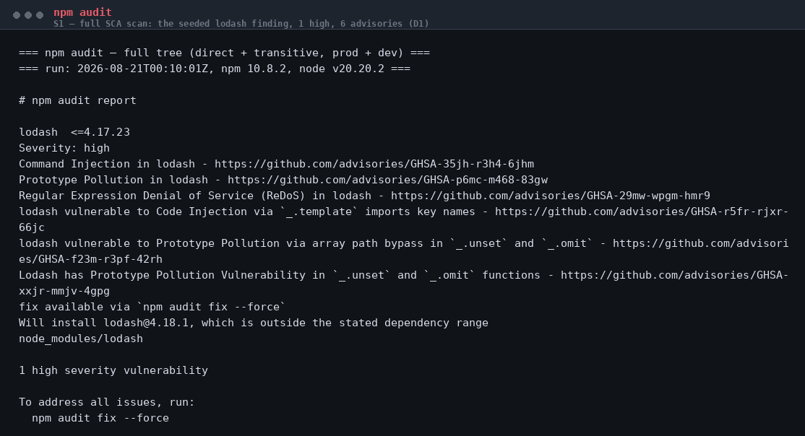
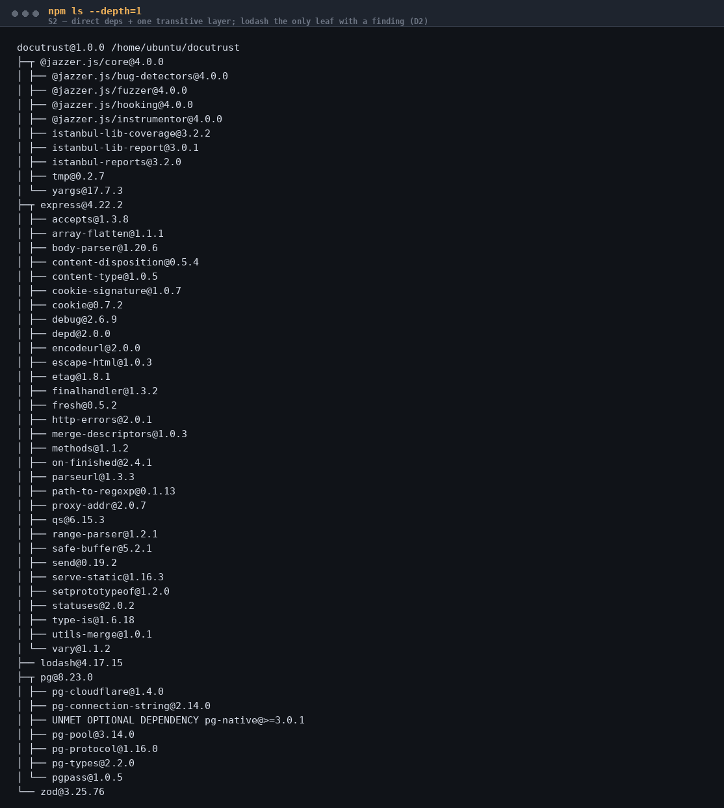
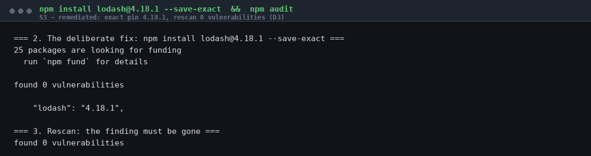
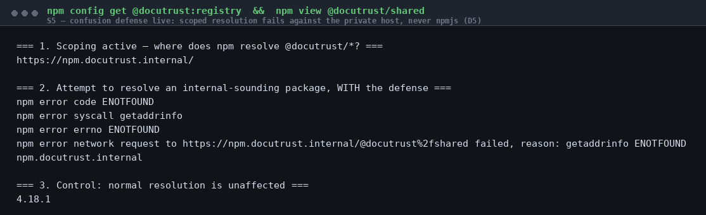
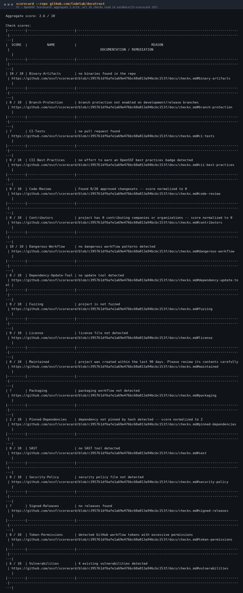
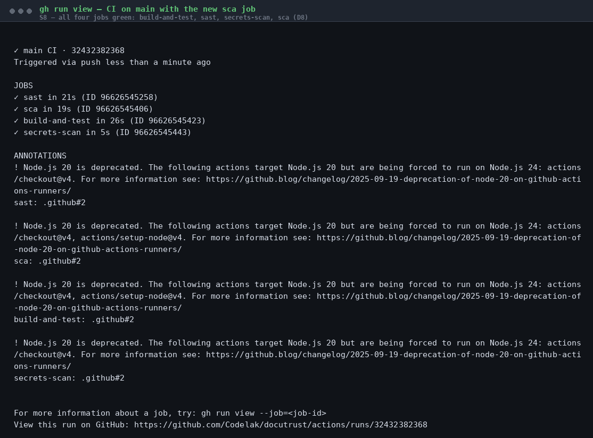
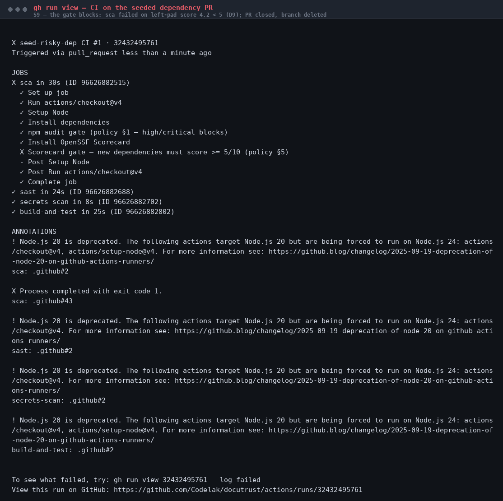

# DocuTrust Walkthrough — SCA, Dependency Confusion & OpenSSF Scorecard

*A beginner's guide to how I carried out Project 2 of the DevSecOps track on
DocuTrust. Every command below actually ran, and every output quoted below is
real output I got. Evidence files and screenshots are cited along the way.
The guide assumes a Bash terminal (macOS, Linux, or WSL2 on Windows) and
Project 1 finished (the SAST and secrets gates exist).*

---

## Starting from this repo (not from the course handout)?

This repo holds the **finished** Project 2 — on `main`, the lodash pin is
already fixed and the SCA gate already exists. To do the project yourself,
start on the `project2-starter` branch instead: it is the finished Project 1
*plus* the seeded, still-vulnerable `lodash@4.17.15` pin, exactly as this
guide assumes:

```bash
git checkout project2-starter
npm ci
```

You are the engineer now. The app has one dependency problem you already know
about (Project 1's SAST scan surfaced it and deliberately did not fix it:
**dependencies are Project 2's job**) and a set of questions nobody has asked:
what else is in the dependency tree, could a malicious package shadow its way
in, and how healthy are the upstream projects we rely on. Your job is to find
out, fix what needs fixing, and build a policy that keeps the next risky
dependency from getting in quietly.

When you reach the CI stage (Stage 9), push to **your own fork** of this repo
so GitHub Actions runs for you.

---

## Stage 1 — Baseline: know what you're scanning

**Problem:** you cannot secure a dependency tree you have not enumerated.
**Approach:** list the app's own declarations, then the whole installed tree.

First, what does the app *declare*?

```bash
cat package.json
```

The dependencies block is the surface to defend. In the starter state it
contains the seeded finding, declared with suspicious precision:

```json
"dependencies": {
  "express": "^4.19.2",
  "pg": "^8.13.0",
  "zod": "^3.23.8",
  "lodash": "4.17.15"
}
```

Everything else uses a caret (`^4.19.2` — "any 4.x at least this new") but
lodash is **pinned exactly** (`4.17.15` — "this version and no other"). An
exact pin is a reproducibility choice; it is also exactly what a seeded
vulnerable version looks like. Remember it for Stage 4.

Now the whole tree — direct *and* transitive:

```bash
npm ls --all
```

`npm ls --all` walks everything: what you declared, what those packages
declared, and what those declared. 300+ lines. This is the tree you are about
to scan, and Stage 3 walks it by hand. Keep the output; you will need it.

---

## Stage 2 — The SCA scan (Deliverable 1)

**Problem:** which of these packages has a *known, disclosed* vulnerability?
**Approach:** the standard SCA tool for npm — `npm audit` — against the full
tree (it scans transitives too, by default, in both prod and dev).

```bash
npm audit
```

The output, in full, from the real starter state:



```
# npm audit report

lodash  <=4.17.23
Severity: high
Command Injection in lodash - GHSA-35jh-r3h4-6jhm
Prototype Pollution in lodash - GHSA-p6mc-m468-83gw
Regular Expression Denial of Service (ReDoS) in lodash - GHSA-29mw-wpgm-hmr9
lodash vulnerable to Code Injection via `_.template` imports - GHSA-r5fr-rjxr-66jc
lodash vulnerable to Prototype Pollution via array path bypass in `_.unset`
  and `_.omit` - GHSA-f23m-r3pf-42rh
Lodash has Prototype Pollution Vulnerability in `_.unset` and `_.omit` - GHSA-xxjr-mmjv-4gpg

1 high severity vulnerability
```

**Reading it like an engineer.** npm reports one aggregate finding (the
package) over six advisories (the vulnerabilities). Don't stop at the count —
read the classes and ask what they would mean *in this app*:

- **Prototype pollution** (3 advisories) — an attacker crafts input that
  writes to `Object.prototype`. In Node, polluting a property that gets read
  as a default can become **remote code execution**. Classic entry points:
  `_.merge`, `_.defaultsDeep`, `_.unset`, `_.omit`.
- **Command injection** and **code injection** (2 advisories) — through
  lodash's `_.template` function when it compiles templates from
  attacker-influenced strings.
- **ReDoS** (1 advisory) — a crafted string makes lodash's internal regex
  hang, a cheap denial of service.

Then the honest question: does this app *call* any of those functions?
DocuTrust imports lodash once, for `_.cloneDeep` (a deep copy of a database
row, in `src/routes/documents.js`). None of the six vulnerable functions is
reachable today. So is this a real finding?

**Yes — and this is the professional judgment.** The vulnerable functions
live in the same package, one import away. The day someone writes
`_.merge(req.body, defaults)` — an extremely common refactor — the app
imports a high-severity advisory without a code review noticing. The pin is
deliberately stale. And a `1 high` result fails any serious pipeline gate
(you will build that gate in Stage 9). The fix is free. There is no
justification to carry it. You fix it — in Stage 4, properly, not by magic.

For the record, keep the machine-readable version too — it is what a
reporting tool consumes:

```bash
npm audit --json
```

**Troubleshooting.**

- *"npm ERR! audit ... network"* — npm is talking to registry.npmjs.org;
  check connectivity/proxy. Nothing to do with the code.
- *"found 0 vulnerabilities" when you expected the finding* — you are on
  `main` (already fixed) instead of `project2-starter`, or the lockfile
  resolved a newer lodash; check `npm ls lodash`.

---

## Stage 3 — Transitive review (Deliverable 2)

**Problem:** a dangerous package three levels deep is exactly what a
direct-dependencies-only review misses. **Approach:** walk the `npm ls --all`
tree from Stage 1 and look at what our packages themselves depend on.



The full tree has 300+ entries, but the review is quick if you know where to
look: **the interesting ones are the leaves of popular packages.** Four
specific transitive packages, all real, all from the actual tree:

| Transitive package | Via | Why it matters | Verdict |
|---|---|---|---|
| `path-to-regexp@0.1.13` | express | the package behind express's ReDoS chain (CVE-2024-45296, CVE-2024-52960, CVE-2025-46665) | **patched line in use** — 0.1.13 is the fixed version express pins today |
| `cookie@0.7.2` | express | cookie <0.7.0 could corrupt memory on malformed cookies (CVE-2024-47764) | **patched** |
| `qs@6.15.3` | express / body-parser | qs <6.9.1 had prototype pollution (CVE-2022-24999) | **patched, well past** |
| `pg-native` (UNMET OPTIONAL) | pg | native C++ bindings — only installed if explicitly requested; it is not in the tree | **absent** — watch item if ever enabled |

Two more observations that matter:

1. **lodash@4.17.15 has zero dependencies of its own.** It is a leaf. Its
   six advisories live entirely in its own code — no deeper layer to inspect.
2. **The tree is single-instance.** Every shared transitive is `deduped` —
   no hidden second copies holding older vulnerable versions. That is the
   situation a naive review silently assumes; here, `npm ls --all` *proves*
   it instead of assuming it.

**Verdict:** no dangerous transitive package found; the single real finding
in the entire tree is the direct lodash pin. That clean statement is
itself a deliverable — a review that names its packages and states a
conclusion, not a wall of names.

**Troubleshooting — this happened during the real run:**

```
npm error invalid: lodash@4.18.1 /home/ubuntu/docutrust/node_modules/lodash
```

`npm ls` reported `ELSPROBLEMS` — the installed `node_modules` had drifted
from the lockfile (the repo had been reset; the lockfile said 4.17.15, the
folder held something else). The fix is the professional rule: **the lockfile
is truth, `node_modules` is disposable** — reinstall it.

```bash
npm ci
```

If `npm ls` ever prints `invalid` or `ELSPROBLEMS`, this is the reason and
this is the fix.

---

## Stage 4 — Remediate lodash, for real (Deliverable 3)

**Problem:** the finding must actually go away — not be documented, not be
suppressed. **Approach:** the professional fix, in the professional order:
attempt the tool's own fix first, understand why it balks, fix deliberately,
rescan, and **reverify by running the app**.

Step 1 — try npm's suggestion without the dangerous flag:

```bash
npm audit fix
```

Nothing changes:

```
1 high severity vulnerability
To address all issues, run:
  npm audit fix --force
```

**Why does plain `npm audit fix` do nothing?** Because of the exact pin from
Stage 1. `npm audit fix` only updates *within the declared semver range*;
`4.17.15` declares no range. Only `--force` overrides, and `--force` is
allowed to do breaking things — the flag you do not type casually in a
pipeline. The teaching point: **exact pins are great for reproducibility and
exactly what makes the automated fixer refuse to touch you.** You fix by hand.

Step 2 — the deliberate fix (note `--save-exact`: we keep the pin style, we
just pin the *patched* version):

```bash
npm install lodash@4.18.1 --save-exact
```

Step 3 — rescan. The finding must be gone:

```bash
npm audit
```



```
found 0 vulnerabilities
```

Step 4 — reverify, don't trust. Two gotchas, both real:

- A **running app keeps the old version in memory** — restart it
  (`npm start`) so the new lodash is actually loaded.
- The route that uses `_.cloneDeep` must still work over HTTP:

```bash
curl -X POST http://localhost:3000/documents \
  -H "Content-Type: application/json" \
  -d '{"title":"smoke","body":"after upgrade"}'
```

Real response: `{"id":8,"title":"smoke","body":"after upgrade",...}` — 201,
deep-cloned row returned. The fix is verified end to end.

(Full before/after captures: `evidence/12-lodash-fix/`.)

**Troubleshooting.**

- *"npm audit fix did nothing"* — exact pin; see Step 1. Not a bug.
- *"npm ERR! code EEXIST / EPERM"* — a stale process holds files; restart the
  app, remove `node_modules`, `npm ci`.
- *App 503s after restart* — the database env isn't loaded; the app does not
  read `.env.local` itself: `set -a && . ./.env.local && set +a` before
  starting.

---

## Stage 5 — The SCA policy (Deliverable 4)

**Problem:** one fix is a moment; a policy is what stops the next finding.
**Approach:** write the threshold down — specific, checkable, with an
exception path — and make the CI enforce it (Stage 9). The policy lives at
`docs/project-2/sca-policy.md`. Its load-bearing numbers:

- **Blocks the build:** any high or critical advisory —
  `npm audit --audit-level=high` must exit 0 on every push and PR.
- **Allowed with justification:** moderate/low advisories, listed in the
  risk report, re-reviewed quarterly.
- **Exceptions:** high/critical only if no patched release exists anywhere;
  written request → explicit maintainer sign-off → expires end of quarter.
- **New dependencies:** must pass the audit gate *and* score ≥ 5/10 on
  OpenSSF Scorecard (Stages 8–9), and get the typosquat review (Stage 7).

"Fix everything" is not a policy; "use good judgment" is not a policy. A
policy names a command, a threshold, and an approver. This one does.

---

## Stage 6 — Dependency confusion defense (Deliverable 5)

**Problem:** npm resolves a package by name against a registry — and cannot
tell "internal package" from "public package with the same name." If an
attacker publishes `@docutrust/shared` on the public registry, and a
developer adds `@docutrust/shared` to package.json, npm installs the
attacker's code. That attack is called **dependency confusion**, and it works
silently. **Approach:** pin the internal namespace to the private registry so
npm never even *asks* the public registry about it.

The `.npmrc`:

```ini
@docutrust:registry=https://npm.docutrust.internal/
registry=https://registry.npmjs.org/
```

(In a real org, the first line points at the org's private registry —
GitHub Packages, Verdaccio, Artifactory — usually behind auth, which adds a
second layer: the auth token is registry-specific, so a public squat cannot
be fetched even by mistake.)

**Prove it works, don't describe it.** Try to resolve an internal-sounding
package, with the defense in place:

```bash
npm config get @docutrust:registry
npm view @docutrust/shared
```



```
ENOTFOUND ... network request to https://npm.docutrust.internal/@docutrust%2fshared
```

npm failed **against the private host** — it never contacted
registry.npmjs.org for that scope. Fail-closed: no fallback, no silent
shadow. Now the control — the same lookup pointed at the public registry
(which is npm's default behavior *without* the `.npmrc`):

```bash
npm view @docutrust/shared --@docutrust:registry=https://registry.npmjs.org/
```

```
404 Not Found - GET https://registry.npmjs.org/@docutrust%2fshared
```

npm asked the public registry. The 404 today is luck — a squat with that
name would have returned 200 and been installed. **Defense: blocked at the
private host. No defense: public registry consulted.** That contrast is the
demonstration.

Normal resolution is untouched — `npm view lodash version` still answers
(`4.18.1` after Stage 4).

**Troubleshooting.**

- *`npm view` of ANY `@docutrust/*` name fails with ENOTFOUND* — correct;
  that is the defense. To probe the public registry deliberately, use the
  `--@docutrust:registry=` override above (this is exactly what Stage 7 does).
- *`npm ci` fails after adding `.npmrc`* — only if you added a scoped
  dependency; that is the defense refusing. Public dependencies are
  unaffected.

---

## Stage 7 — Typosquatting check (Deliverable 6)

**Problem:** a squatter publishes a near-variant of a popular name —
`loadsh` for `lodash`, `expresss` for `express` — hoping a typo or
autocomplete slips it into a build. **Approach:** manual review with real
registry probes, one near-variant at a time, and judge each find.

The probe that answers "does this name exist, who owns it, since when":

```bash
npm view <name> version time.created maintainers
```

Real probes and verdicts (all captured in `evidence/14-typosquat/`):

| Probe | What came back | Verdict |
|---|---|---|
| `npm view expresss` | v0.0.0, created 2016, personal email | **squat-shaped** — placeholder version, 6 years after the original |
| `npm view express1` | v1.0.0, created 2019, QQ-mail owner | **squat-shaped** — one version, disposable-account pattern |
| `npm view js-express` | **Unpublished on 2026-04-03** | published then removed — registry churn, takedown-shaped |
| `npm view xpress` | v2.4.6, 52 versions | **legit alternative framework** — the judgment case |
| `npm view lodashs` | **Unpublished 2020-08-25** | a squat that existed and was removed |
| `npm view lodash-package` | v1.0.0, created **2024-02-01** | **squat-shaped and fresh** |
| `npm view loadsh` | v0.0.4, created 2018 | **the classic documented lodash squat** — still live |
| `npm view zod-js` | v0.0.1-security, created **2026-01-19** | **npm security takedown** — this version name is what npm leaves after removing a malicious package. A real squat, three months ago, on a name adjacent to a dependency we actually use. |
| `npm view pg1` | **Unpublished 2023-06-29** | removed squat |
| `npm view js-pg`, `pgs` | 2017 / 2016, single versions | squat-shaped |

The judgment skill, in one table:

| Signal | Squat | Legit |
|---|---|---|
| published after the original | yes | possible (fork) |
| version count | 0–1, placeholder `0.0.0` | many, real releases |
| maintainer | unknown / disposable email | known maintainers |
| version `0.0.1-security` | **npm security takedown** | never |

Finally, probe our own namespace on the public registry (the Stage 6
scenario, other side): is there a squat waiting under `@docutrust/*`?

```bash
npm view @docutrust/shared --@docutrust:registry=https://registry.npmjs.org/
# ...utils, config, core, auth
```

All: `404 Not Found` — **nothing published under our scope.** A genuine
negative finding, and the Stage 6 scoping is what keeps it negative.

**Conclusion:** 8 of 14 probed near-variants exist or existed; zero is in
our tree. The defense is not luck — it is exact pins, the lockfile, the
audit gate, and the scope pinning, all already in place. The `zod-js`
takedown is the standing reminder that the attack is live.

**Troubleshooting.**

- *`npm view` of a variant returns E404* — the name is free right now.
  Record it; re-check on the next quarterly review.
- *Suspicious but few versions* — check the maintainer email domain and
  creation date vs. the original. Disposable mail + post-original creation +
  one version = squat profile.

---

## Stage 8 — OpenSSF Scorecard (Deliverable 7)

**Problem:** CVEs say "this version has a known bug." They say nothing about
"this project is abandoned" — the risk class that killed left-pad-style
dependencies. **Approach:** run the OpenSSF Scorecard, the industry tool that
scores a repository's supply-chain hygiene mechanically, and **read every
check** rather than the headline number.

Install and run:

```bash
# install the official CLI (scorecard v5.5.0)
curl -sL https://github.com/ossf/scorecard/releases/download/v5.5.0/scorecard_5.5.0_linux_amd64.tar.gz -o scorecard.tar.gz
tar -xzf scorecard.tar.gz scorecard
sudo mv scorecard /usr/local/bin/

export GITHUB_AUTH_TOKEN=$(gh auth token)   # scorecard reads the GitHub API
scorecard --repo github.com/Codelak/docutrust
```



Real result: **aggregate 2.6 / 10** — 2 checks at 10, 12 at 0, 3 not
applicable. Reading it properly, the zeros split into three honest groups:

1. **Repo youth** — `Maintained` (created <90 days ago), `Contributors`
   (solo project). Structural; they improve with time and activity.
2. **Real, cheaply fixable gaps** — `Security-Policy` (no SECURITY.md),
   `License` (no LICENSE), `Token-Permissions` (no `permissions:` blocks),
   `Pinned-Dependencies` (actions pinned by tag, not hash),
   `Dependency-Update-Tool` (no Dependabot). All tracked as follow-ups.
3. **Deliberate architecture** — `Code-Review` 0/28 (this repo's projects
   are sequential and CI gates do the blocking; PR-based flow is the
   professional norm and is on the follow-up list). And a crucial one to
   understand: **`SAST` 0/10 even though Project 1 runs semgrep and gitleaks
   in CI** — Scorecard's SAST check counts CodeQL and nothing else. Your
   gates are real; this particular lens cannot see them. **A score is a
   lens, not the truth.**

The full per-check reading is in `evidence/15-scorecard/README.md`.

**Troubleshooting.**

- *`scorecard: command not found`* — the tar extracts a binary named
  `scorecard`; check the extraction path.
- *scorecard exits with GitHub API errors* — the token. `gh auth status`;
  if unauthenticated, `gh auth login` and export the token as above.
- *Scores differ run to run* — `Maintained` and `Vulnerabilities` move with
  the repo's age and open alerts; `CI-Tests`/`Code-Review` need PR activity.
  Same tool, same repo, later date — different snapshot. That is normal.

---

## Stage 9 — The policy becomes a gate (Deliverable 8)

**Problem:** a threshold nobody enforces is a suggestion. **Approach:** wire
both gates into CI so every push and PR is judged automatically. The new
`sca` job in `.github/workflows/ci.yml`, next to Project 1's `sast` and
`secrets-scan` jobs, runs two steps.

Step 1 — the CVE gate, one line (the policy's §1 verbatim):

```yaml
- name: npm audit gate (policy §1 — high/critical blocks)
  run: npm audit --audit-level=high
```

`npm audit` exits non-zero on a high/critical finding → the job fails → the
workflow fails → the merge is blocked. That non-zero exit *is* the gate.

Step 2 — the health gate for **new** dependencies (policy §5). Read it line
by line; it is five ordinary tools in sequence:

```yaml
- name: Scorecard gate — new dependencies must score >= 5/10 (policy §5)
  env:
    GITHUB_AUTH_TOKEN: ${{ secrets.GITHUB_TOKEN }}
  run: |
    set -euo pipefail
    threshold=5

    # 1. Which dependencies are NEW in this branch?
    base="$(git show origin/main:package.json 2>/dev/null \
              | jq -r '.dependencies + .devDependencies | keys[]' || true)"
    now="$(jq -r '.dependencies + .devDependencies | keys[]' package.json)"
    new_deps="$(comm -13 <(printf '%s\n' "$base") <(printf '%s\n' "$now"))"

    if [ -z "$new_deps" ]; then
      echo "scorecard gate: no new dependencies vs main — pass"
      exit 0
    fi

    # 2. Score each new dependency with the official scorecard CLI.
    failed=0
    for dep in $new_deps; do
      score="$(scorecard --npm "$dep" --format json | jq -r '.score')"
      if [ "$score" = "null" ]; then
        echo "  FAIL  $dep — no score obtainable: manual review required"
        failed=1
      elif awk -v s="$score" -v t="$threshold" 'BEGIN { exit !(s >= t) }'; then
        echo "  PASS  $dep — score $score"
      else
        echo "  FAIL  $dep — score $score below threshold $threshold"
        failed=1
      fi
    done

    [ "$failed" = 0 ] || { echo "scorecard gate FAILED — sca-policy.md §5"; exit 1; }
    echo "scorecard gate: pass"
```

Decoding it: `git show origin/main:package.json` fetches the main branch's
dependency list; `jq` turns both lists into sorted names; `comm -13` prints
names that exist *only* in the new list (the "new dependencies"); the loop
runs the official `scorecard --npm <pkg>` for each; `jq -r '.score'` reads
the aggregate; `awk` does the numeric comparison; any score below 5 (or no
score at all — fail-closed) marks `failed`; the step exits 1 → red run.

Push to `main` and watch the run:

```bash
git push origin main
gh run watch
```



Real result — all four jobs green, including the new one:

```
✓ sast in 21s   ✓ sca in 19s   ✓ build-and-test in 26s   ✓ secrets-scan in 5s
```

And inside the sca job's log, the two gates reporting for real:

```
npm audit gate (policy §1)    -> found 0 vulnerabilities
Scorecard gate (policy §5)    -> no new dependencies vs main — pass
```

(Full log: `evidence/16-ci-gates/`.)

**Troubleshooting.**

- *The sca job fails with "no new dependencies" never printed* — the diff
  failed: `git show origin/main:package.json` needs the main branch present
  in the checkout. The job uses `fetch-depth: 0` for exactly this reason.
- *Your new dependency is healthy but the gate fails with "no score
  obtainable"* — scorecard could not find the package's source repo (or it
  is not on GitHub). Fail-closed is deliberate: an unscoreable dependency
  needs maintainer documentation, per policy §5.
- *`jq: command not found` on your laptop* — install it; GitHub runners ship
  it preinstalled.

---

## Stage 10 — Prove the gate blocks (Deliverable 9)

**Problem:** a gate that has never failed anything is a rumor. The brief
demands proof: a deliberately risky dependency, added on a branch, must be
blocked before it could reach main. **Approach:** seed one, let the gate do
its job, read the failure, revert.

Pick the seed: `left-pad@1.3.0` — a real package with a famous story (the
2016 npm incident that broke the ecosystem), an archived repository, and a
real scorecard score we can measure:

```bash
scorecard --npm left-pad --format json | jq -r .score
# 4.2   <- below the 5/10 threshold, and npm audit passes it (no CVEs!)
```

That last part is the point: **left-pad has no known CVEs, so the npm audit
gate will let it through.** Only the scorecard gate can catch it — an
abandoned repository is exactly the risk class the CVE database cannot see.

On a branch:

```bash
git checkout -b seed-risky-dep
npm install left-pad@1.3.0 --save-exact
git commit -am "seed risky dependency"
git push origin seed-risky-dep
gh pr create
```

CI runs on the PR. The sca job's log:

```
npm audit gate (policy §1)          -> found 0 vulnerabilities      (passes!)
Scorecard gate: scoring new dependencies:
  - left-pad
  FAIL  left-pad — score 4.2 below threshold 5 (policy §5)
scorecard gate FAILED — docs/project-2/sca-policy.md §5
```



The run view: `X sca in 30s` — the gate blocked the merge, while npm itself
even added its own corroboration at install time:

```
npm warn deprecated left-pad@1.3.0: use String.prototype.padStart()
```

Then the professional close-out:

```bash
gh pr close 1 --comment "Blocked by the scorecard gate (4.2 < 5). Intentional seed."
gh pr delete 1 --yes
git checkout main && git branch -D seed-risky-dep
```

The seeded dependency never touched main. The gate proved itself.

**Troubleshooting.**

- *The PR run is green when you expected red* — did `npm install` actually
  add the package, and does the branch's package.json differ from main? The
  gate scores *new* names; a dependency that already existed on main is
  deliberately not re-scored.
- *The sca job fails at `npm ci`, before the gates* — you seeded a scoped
  `@docutrust/*` name; the Stage 6 `.npmrc` defense refused it at install.
  That is the *other* gate working. Use either failure mode for your seed —
  both are legitimate demonstrations.

---

## Stage 11 — The report (Deliverable 10)

**Problem:** all of this has to hand over to Project 3 with a clean,
current baseline. **Approach:** one report —
`docs/project-2/final-findings-report.md` — that any engineer can read in
five minutes: what was found, what was fixed, what is enforced, and the
exact dependency list Project 3 starts from:

| Package | Version | Pin | Audit | Scorecard |
|---|---|---|---|---|
| express | 4.22.2 | ^4.19.2 | clean | 8.2 |
| pg | 8.23.0 | ^8.13.0 | clean | 5.7 |
| zod | 3.25.76 | ^3.23.8 | clean | 5.3 |
| lodash | 4.18.1 | exact | clean | 6.8 |
| @jazzer.js/core (dev) | 4.0.0 | ^4.0.0 | clean | 6.0 |

`npm audit` → **0 vulnerabilities.** That is the baseline Project 3's
runtime conclusions will stand on.

---

## Deliverable map

| Stage | Deliverable | Evidence |
|:---|:---|:---|
| 2 | 1 — full SCA scan, real output | `evidence/10-sca-baseline/` |
| 3 | 2 — transitive review, specific packages named | `evidence/11-transitive-review/` |
| 4 | 3 — lodash remediated, rescan clean, smoke-tested | `evidence/12-lodash-fix/` |
| 5 | 4 — SCA policy, checkable thresholds | `docs/project-2/sca-policy.md` |
| 6 | 5 — confusion defense configured + demonstrated | `evidence/13-scope-demo/` |
| 7 | 6 — typosquat review, genuine findings | `evidence/14-typosquat/` |
| 8 | 7 — scorecard run, every check read | `evidence/15-scorecard/` |
| 9 | 8 — scorecard policy enforced in CI | `evidence/16-ci-gates/` |
| 10 | 9 — seeded dep blocked before merge | `evidence/16-ci-gates/run-seeded-PR-FAILED.txt` |
| 11 | 10 — final dependency risk report | `docs/project-2/final-findings-report.md` |
| 1–11 | screenshots 08–15 | `docs/project-2/images/` |

## What's next

Project 3 (DAST/IAST/RASP) tests DocuTrust's *runtime* behavior. Its
conclusions are only trustworthy against a clean, current, enforced
dependency baseline — which is what this project just produced and what the
report hands over.
