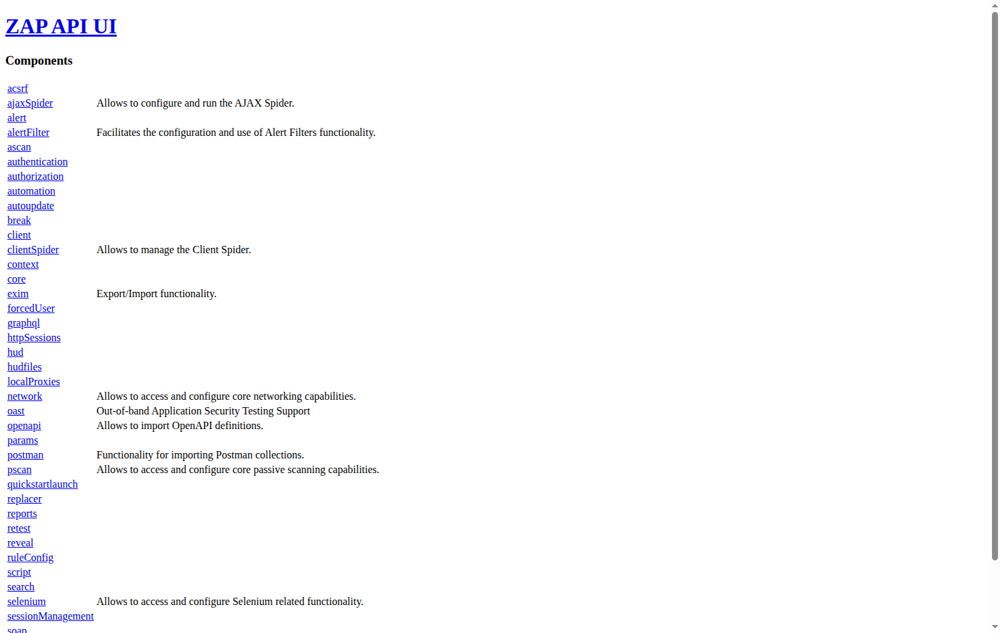
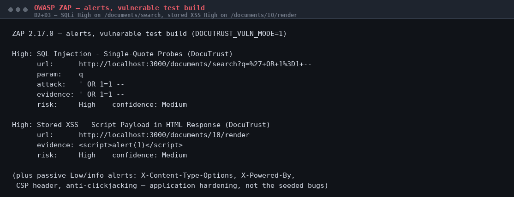
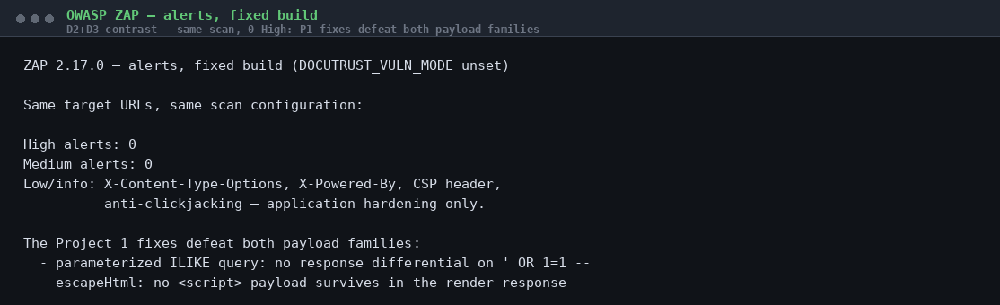
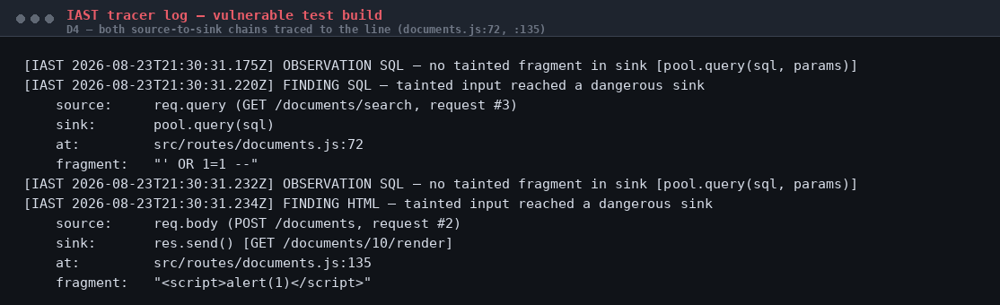
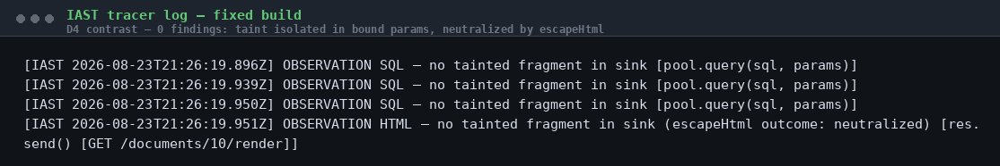
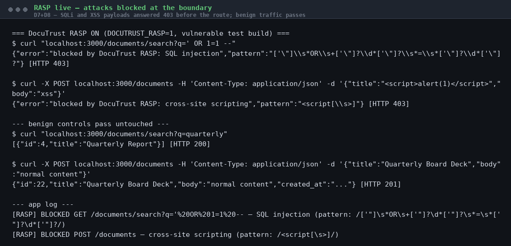
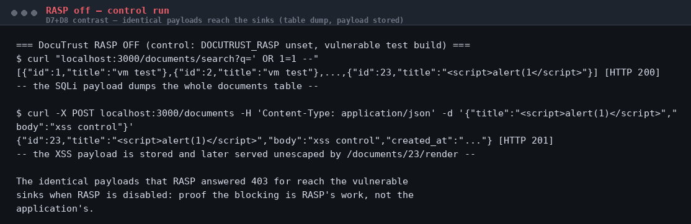

# DocuTrust Walkthrough — DAST, IAST & RASP, Compared for Real

*A beginner's guide to how I carried out Project 3 of the DevSecOps track on
DocuTrust. Every command below actually ran, and every output quoted below is
real output I got. Evidence files, figures, and screenshots are cited along
the way. The guide assumes a Bash terminal (macOS, Linux, or WSL2 on
Windows), Node 20 + Postgres (Project 1's setup), and Java 17 + OWASP ZAP —
installed in Stage 2. Projects 1 and 2 finished (the fixes and CI gates
exist).*

---

## Starting from this repo (not from the course handout)?

This repo holds the **finished** Project 3 — on `main`, the fixes from
Project 1 are in place, the SCA gate exists, and the runtime tooling lives
in `src/lib/iast.js`, `src/lib/rasp.js`, and `security/zap/`. To do the
project yourself, start on the `project3-starter` branch instead: it is the
finished Project 2, exactly as this guide assumes:

```bash
git checkout project3-starter
npm ci
```

Here is the situation: Projects 1 and 2 have already found and fixed two
real vulnerabilities by reading the source and scanning dependencies —
SQL injection in the search endpoint and stored XSS in the document render
page. A real attacker has none of that. Your job is to test the *same two
bugs* the way an outside attacker would (DAST), the way a security-
instrumented QA process would (IAST), and to build a live defense that
blocks exploitation as it happens (RASP) — then explain, from your own
output, what each of the three can catch that the others cannot. SAST
already said "vulnerable" in Project 1; DAST, IAST and RASP will prove it,
explain it, and stop it.

---

## Stage 0 — The test build: the bugs come back, on purpose

The two vulnerabilities were **fixed** in Project 1, so the running app is
no longer exploitable. But you cannot scan what does not exist. The
project's answer is a documented **test build**: the same two pre-fix code
shapes, restored verbatim behind an environment flag, default OFF.

```bash
set -a && . ./.env.local && set +a   # loads DATABASE_URL (no dotenv in this app)
npm run migrate
DOCUTRUST_VULN_MODE=1 npm start      # the deliberately vulnerable test build
```

Verify the two bugs are back, exactly as seeded (this is also your
baseline "vulnerable" evidence):

```bash
curl -s "localhost:3000/documents/search?q='%20OR%201=1%20--"
# [{"id":1,"title":"vm test"},{"id":2,...},...]   <- the whole table, HTTP 200

curl -s localhost:3000/documents/10/render
# <html><body><h1><script>alert(1)</script></h1>...   <- unescaped payload
```

The payload works because the search query is built by string
concatenation (`documents.js`, the original seeded shape) and the render
page interpolates the title unescaped. Restart without the flag and both
probes come back clean — that is the fixed build you will contrast
against in every stage. The flag is a footgun; production must never set
it.

> **Where's the evidence:** `evidence/project-3/17-zap-dast/` and the
> findings tables in `docs/project-3/final-findings-report.md` describe
> the build and the two bugs in detail.

---

## Stage 1 — DAST: OWASP ZAP, black-box (Deliverables 1–3)

### 1.1 Install ZAP

ZAP is a Java application. On a headless Linux box:

```bash
sudo apt-get install -y openjdk-17-jre-headless
# download ZAP from https://github.com/zaproxy/zaproxy/releases (the
# ZAP_2.17.0_Linux.tar.gz build), extract it:
mkdir -p ~/zap && tar -xzf ZAP_2.17.0_Linux.tar.gz -C ~/zap --strip-components=1
```

Start it in daemon mode (the web UI + API on port 8090):

```bash
~/zap/zap.sh -daemon -port 8090 \
  -config api.disablekey=true \
  -config api.addrs.addr.name=127.0.0.1 -config api.addrs.addr.regex=false
```

Open **http://localhost:8090/ui/** in your browser. On a remote box,
tunnel it first: `ssh -L 8090:127.0.0.1:8090 user@host`. You get ZAP's
web UI — every component is a clickable page: `core` (sites, alerts),
`spider`, `ascan` (the active scanner), `reports`.



### 1.2 The incident: the first scan kills the app (real, and expected)

Point ZAP at the vulnerable build and run the scan. **It crashes the app
mid-scan.** That is not a broken scanner — it is the application's second
seeded bug revealing itself. ZAP's SQL injection rule sends a probe
containing an unclosed double quote; DocuTrust's naive search parser
(`src/lib/searchQuery.js`) enters an infinite loop on unclosed quotes and
grows memory until the process dies:

```
FATAL ERROR: Ineffective mark-compacts near heap limit
             Allocation failed - JavaScript heap out of memory
```


That infinite loop is a real denial-of-service bug, deliberately **not**
fixed here: it is Project 7's fuzz target, and Project 7 is the project
that gets to find and fix it. For now you work around it the way a real
scanner operator would — constrain the probe set.

### 1.3 The two custom rules (loaded in the ZAP UI)

`security/zap/` ships two rules used by this project's scans:

- **`sqli-single-quote.js`** (active rule, id 90099) — probes the `q`
  parameter with a curated single-quote-only payload set and detects the
  injection by response differential: the `' OR 1=1 --` payload dumps
  the whole table, so the response is far longer than the baseline.
  Double-quote payloads are deliberately excluded for the reason above.
- **`xss-stored-passive.js`** (passive rule, id 90100) — raises an XSS
  alert when an HTML response contains an executable script payload:
  the response-side signature of stored XSS, which stock rules cannot
  see (they inject into request parameters; a stored payload is
  database state, not a parameter).

In the ZAP UI: **Scripts panel → New → load each file**, then enable
them. In the scan below, every stock rule except the custom SQLi rule is
disabled so no double-quote probe reaches the app.

Both rules are deliberately simple and documented as illustrative —
pattern-based, no encoding resistance. The evidence README
(`evidence/project-3/17-zap-dast/README.md`) explains the full reasoning.

### 1.4 The scan (Deliverables 2 and 3)

Feed ZAP the two target URLs (search + the stored-XSS render), run the
active scan on `/documents/search`, and let the passive scanner process
the render response. The alerts:

```
High: SQL Injection - Single-Quote Probes (DocuTrust)
      url:      http://localhost:3000/documents/search?q=%27+OR+1%3D1+--
      param:    q
      attack:   ' OR 1=1 --
      evidence: ' OR 1=1 --

High: Stored XSS - Script Payload in HTML Response (DocuTrust)
      url:      http://localhost:3000/documents/10/render
      evidence: <script>alert(1)</script>
```



ZAP found the same two bugs Project 1 found by reading the source —
except ZAP had **no source access at all**: it attacked the running app
from outside. Both alerts land in the scan report
(`evidence/project-3/17-zap-dast/zap-vuln-scan.html`), and the report
renders in a browser like any page:


The payloads' effect is visible in a browser too — the SQLi probe returns
the whole documents table:


### 1.5 The contrast: same scan, fixed build (zero findings)

Restart the app **without** `DOCUTRUST_VULN_MODE`, repeat the exact same
scan. The parameterized query returns no differential for the SQLi
probes, and the escaped render output contains no script payload:

```
High alerts: 0
Medium alerts: 0
Low/info: X-Content-Type-Options, X-Powered-By, CSP header,
          anti-clickjacking — application hardening only.
```



DAST now tells you something precise about the fixed build: the
vulnerabilities it proved against the test build are gone from the
running application. What it still cannot tell you is *which line of
code* was at fault — that is the IAST stage.

---

## Stage 2 — IAST: watch the data move (Deliverables 4–5)

There is no viable free Node.js IAST product — the one OWASP's own list
names reached end-of-life and never supported Node anyway. So, per the
brief, this project builds the underlying mechanism from first
principles: `src/lib/iast.js`, a real source-to-sink taint tracer.

### 2.1 How it works (the module header says it all, honestly)

- **Sources:** query and body values are registered as *tainted
  fragments* (value → where it came from → which request). The registry
  is shared across requests — that is what lets taint survive the
  database round-trip of stored XSS.
- **Sinks:** `pool.query` (SQL text) and `res.send` (HTML responses)
  are wrapped. If a sink argument contains a tainted fragment, the taint
  reached it.
- **Sanitizer recognition by outcome:** `escapeHtml` output no longer
  contains the fragment, so the fixed path logs the taint as
  neutralized — observed, not hardcoded.
- Documented scope: fragment-based propagation (no encoding
  resistance), `req.params` not marked (no seeded sink consumes them),
  illustrative, not production.

Enable it: `DOCUTRUST_IAST=1` (add `DOCUTRUST_VULN_MODE=1` for the
vulnerable run).

### 2.2 The run (same five requests, two builds)

Vulnerable build — POST the XSS payload, run the SQLi search, render the
document:

```
FINDING SQL — tainted input reached a dangerous sink
    source:     req.query (GET /documents/search, request #3)
    sink:       pool.query(sql)
    at:         src/routes/documents.js:72
    fragment:   "' OR 1=1 --"

FINDING HTML — tainted input reached a dangerous sink
    source:     req.body (POST /documents, request #2)
    sink:       res.send() [GET /documents/10/render]
    at:         src/routes/documents.js:135
    fragment:   "<script>alert(1)</script>"
```



Fixed build — same five requests, zero findings:

```
OBSERVATION SQL — no tainted fragment in sink [pool.query(sql, params)]
OBSERVATION HTML — no tainted fragment in sink
    (escapeHtml outcome: neutralized) [res.send() [GET /documents/10/render]]
```



### 2.3 DAST versus IAST, from real output (Deliverable 5)

Lay the two tools' output side by side. **ZAP said:** `/documents/search`
is SQLi-vulnerable (URL + parameter). **IAST said:** `req.query.q` from
`GET /documents/search` reaches `pool.query` at `documents.js:72`. For
the XSS: **ZAP said** the render endpoint carries a script payload;
**IAST said** `req.body.title` from a POST reaches `res.send` at
`documents.js:135` — **two requests later**, the database round-trip
that DAST structurally cannot see. Both tools are right; they answer
different questions. That concrete difference — endpoint versus
line-and-path — is what most engineers collapse into "they're all
runtime scanners". They are not.

---

## Stage 3 — RASP: block it live (Deliverables 6–8)

### 3.1 The middleware

`src/lib/rasp.js` is Express middleware mounted **before** the routes:
it inspects every incoming request (query, path params, JSON body) for
the two seeded attack families and answers **403** before the request can
reach the vulnerable code. Enable with `DOCUTRUST_RASP=1`; the kill
switch is documented — unset it. The module header states its honest
scope in plain words: pattern-based, trivially bypassable by encoding,
**illustrative infrastructure, not a production-grade product** — the
brief explicitly requires that framing, and it is not oversold
anywhere in this project.

### 3.2 Live blocks (Deliverables 7 and 8)

App running with `DOCUTRUST_VULN_MODE=1 DOCUTRUST_RASP=1`:

```bash
curl "localhost:3000/documents/search?q=' OR 1=1 --"
# {"error":"blocked by DocuTrust RASP: SQL injection","pattern":"..."}  [403]

curl -X POST localhost:3000/documents -H 'Content-Type: application/json' \
     -d '{"title":"<script>alert(1)</script>","body":"xss"}'
# {"error":"blocked by DocuTrust RASP: cross-site scripting","pattern":"..."} [403]
```

The app log records each block as a single auditable line:

```
[RASP] BLOCKED GET /documents/search?q='%20OR%201=1%20-- — SQL injection (pattern: ...)
[RASP] BLOCKED POST /documents — cross-site scripting (pattern: ...)
```



Benign traffic passes untouched (control requests are part of the
evidence): `?q=quarterly` returns 200, a normal document POST returns
201.

### 3.3 The control run: prove it was RASP (not the app)

Kill the app, restart with **no** RASP flag, fire the identical payloads:

```bash
curl "localhost:3000/documents/search?q=' OR 1=1 --"
# [{"id":1,"title":"vm test"},...]   <- the whole table, HTTP 200

curl -X POST localhost:3000/documents -H 'Content-Type: application/json' \
     -d '{"title":"<script>alert(1)</script>","body":"xss control"}'
# {"id":23,"title":"<script>alert(1)</script>",...}   <- stored, HTTP 201
```



The identical payloads that got 403 reach the vulnerable sinks when RASP
is off: the blocking is the middleware's work. Note the honest boundary
stated in the evidence README: RASP blocks the XSS **delivery** (the
POST that would store the payload), not the render of a payload stored
*before* RASP was enabled — input side only, exactly what the brief asks
("blocks them before they reach the vulnerable route").

---

## Stage 4 — The four-way comparison (Deliverable 9)

The full comparison — SAST (Project 1) vs DAST vs IAST vs RASP, applied
to the same two bugs, every claim grounded in the evidence above — is
`docs/project-3/final-findings-report.md`. The one-paragraph version:

**SAST** reads the source and sees every dangerous shape at rest, but
knows nothing of runtime reachability or data. **DAST** attacks from
outside with no source access and proves an endpoint is exploitable, but
cannot name the line or follow data across requests. **IAST** watches
from inside and names the exact source→sink path — including the
cross-request stored-XSS chain — but only sees paths that execute during
the run. **RASP** blocks arriving attacks before the vulnerable route,
but is input-side and pattern-based: it says nothing about what the
application would do if a payload it does not recognize gets through.
Each one structurally cannot do what the others can; the report says
which, with the actual alert and log lines as evidence.

## Stage 5 — Chain A closing (Deliverable 10)

`docs/project-3/chain-a-closing-report.md` ties Projects 1–3 together:
the same two bugs, six techniques (SAST, secrets scanning, SCA, DAST,
IAST, RASP), the standing CI gates, the deliberately-unfixed known issue
(P7's parser DoS), and what Chain B (Prove) inherits without needing
anything re-explained.

---

## Deliverable map

| Brief deliverable | Where it lives |
|---|---|
| 1 — Real ZAP scan, output captured | `evidence/project-3/17-zap-dast/` (report + alerts + screenshots), figures 16–18, 23–25 |
| 2 — SQLi confirmed externally | `zap-vuln-scan.html`, High alert on `/documents/search` (`' OR 1=1 --`) |
| 3 — XSS confirmed externally | `zap-vuln-scan.html`, High alert on `/documents/10/render` (`<script>alert(1)</script>`) |
| 4 — Working IAST tracer | `src/lib/iast.js`, runs in `evidence/project-3/18-iast/` |
| 5 — DAST vs IAST, compared | Stage 2.3 above + report §3 |
| 6 — Working RASP middleware | `src/lib/rasp.js`, disable switch documented in the module |
| 7 — Live SQLi blocked | `evidence/project-3/19-rasp/rasp-on-transcript.txt` (403 + log line) |
| 8 — Live XSS blocked | same — XSS POST answered 403 before storing |
| 9 — Four-way comparison | `docs/project-3/final-findings-report.md` |
| 10 — Chain A closing | `docs/project-3/chain-a-closing-report.md` |

## What's next

Chain A (Detect) is complete. Chain B (Prove) starts from the assumption
earned by these three projects: DocuTrust's own code and dependencies are
understood and defended at rest and at runtime. Project 4 is SLSA /
hardened build runners — the supply chain moves from "scanned" to
"proven": provenance, artifact attestations, and a build pipeline that
can vouch for itself.
