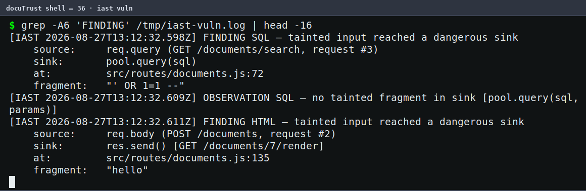

# DocuTrust Walkthrough — DAST, IAST & RASP, Compared for Real

*A beginner's guide to how I carried out Project 3 of the DevSecOps track on
DocuTrust. Every command below actually ran, and every screenshot below is a
real capture of that command on a real terminal — not a drawing. Evidence
files and screenshots are cited along the way. The guide assumes a Bash
terminal (macOS, Linux, or WSL2 on Windows), Node 20 + Postgres (Project
1's setup), and Java 17 + OWASP ZAP — installed in Stage 1. Projects 1 and 2
finished (the fixes and CI gates exist).*

---

## Starting from this repo (not from the course handout)?

This repo holds the **finished** Project 3 — on `main`, the fixes from
Project 1 are in place, the SCA gate exists, and the runtime tooling lives
in `src/lib/iast.js`, `src/lib/rasp.js`, and `security/zap/`. To do the
project yourself, start on the `project3-starter` branch instead: it is the
finished Project 2 (the cumulative snapshot) *plus* this project's test
build — the two seeded bugs behind the `DOCUTRUST_VULN_MODE` flag — and the
runtime modules and ZAP rules you will use:

```bash
git checkout project3-starter
npm ci
```

Here is the situation: Projects 1 and 2 have already found and fixed two
real vulnerabilities by reading the source and scanning dependencies —
SQL injection in the search endpoint and stored XSS in the document render
page. A real attacker has none of that. Your job is to test the *same two
bugs* the way an outside attacker would (DAST), the way a security-
instrumented QA process would (IAST), and to build a live defense that
blocks exploitation as it happens (RASP) — then explain, from your own
output, what each of the three can catch that the others cannot. SAST
already said "vulnerable" in Project 1; DAST, IAST and RASP will prove it,
explain it, and stop it.

### Before you run any stage, know your reset (read once)

The same two-state contract as the earlier projects — Project 3's stages
are all about *server + database* state, so this matters even more here:

**A. The database and the running app.** Every stage restarts the app with
a different flag combination, and the flag is read **at boot** — a running
instance never picks up a changed flag. The standard block, used by every
checkpoint below:

```bash
# 1. stop anything still listening on 3000
pkill -f "node src/index.js" || true

# 2. load the DB credentials
set -a && . ./.env.local && set +a

# 3. reset the data (schema stays; rows and ids go back to zero)
psql "$DATABASE_URL" -c "TRUNCATE documents, comments RESTART IDENTITY CASCADE;"

# 4. prove it (should print one row: 0)
psql "$DATABASE_URL" -c "SELECT count(*) FROM documents;"

# 5. then start the build you need, in a second terminal:
#    DOCUTRUST_VULN_MODE=1 node src/index.js   (vulnerable test build)
#    node src/index.js                          (fixed, production default)
#    DOCUTRUST_IAST=1 DOCUTRUST_VULN_MODE=1 …   (IAST, vulnerable)
#    DOCUTRUST_RASP=1 DOCUTRUST_VULN_MODE=1 …   (RASP, vulnerable)
```

**B. The code state.** `project3-starter` carries the test-build
infrastructure already; you don't patch `src/` in this project. If you
modified anything, reset the branch:

```bash
git checkout project3-starter
git reset --hard origin/project3-starter
git clean -fd
```

---

## Stage 0 — The test build: the bugs come back, on purpose

The two vulnerabilities were **fixed** in Project 1, so the running app is
no longer exploitable. But you cannot scan what does not exist — so the
project's answer is a documented **test build**: the same two pre-fix code
shapes, restored verbatim behind an environment flag, default OFF. The flag
handles it: the app reads `DOCUTRUST_VULN_MODE` once, at boot.

```bash
# checkpoint: stop app, load env, reset data
pkill -f "node src/index.js" || true
set -a && . ./.env.local && set +a
psql "$DATABASE_URL" -c "TRUNCATE documents, comments RESTART IDENTITY CASCADE;"

# in a second terminal, from the project root:
npm run migrate
DOCUTRUST_VULN_MODE=1 node src/index.js
```

Seed the table — deterministically, with captured ids (the DAST rule's
differential check needs a baseline query matching a *subset* of rows, so
we plant five "vm test"/"Quarterly Report" documents and one payload row):

```bash
for t in "vm test 1" "vm test 2" "vm test 3" "vm test 4" "Quarterly Report"; do
  curl -s -X POST localhost:3000/documents -H 'Content-Type: application/json' \
    -d "{\"title\":\"$t\",\"body\":\"seed\"}" >/dev/null
done
XSS_ID=$(curl -s -X POST localhost:3000/documents -H 'Content-Type: application/json' \
  -d '{"title":"<script>alert(1)</script>","body":"xss"}' | jq -r .id)
echo "XSS_ID=$XSS_ID"        # 6 after a reset — this is what the scans reference
```

Verify the two bugs are back, exactly as seeded (this is also your
baseline "vulnerable" evidence):

```bash
curl -s "localhost:3000/documents/search?q=%27%20OR%201=1%20--" | head -c 120
# [{"id":1,"title":"vm test 1"},...   <- the whole table, HTTP 200 (the SQLi)

curl -s localhost:3000/documents/$XSS_ID/render | head -c 90
# <html><body><h1><script>alert(1)</script></h1>...   <- unescaped payload (the XSS)
```

The payload works because the search query is built by string
concatenation (`src/routes/documents.js`, the original seeded shape) and
the render page interpolates the title unescaped.

**The control for every stage:** restart the app **without** the flag
(`node src/index.js`) and both probes come back clean — that is the fixed
build you contrast against. *The flag is a footgun; production must never
set it.*

> **Where's the evidence:** `evidence/project-3/17-zap-dast/` and the
> findings tables in `docs/project-3/final-findings-report.md` describe
> the build and the two bugs in detail.

---

## Stage 1 — DAST: OWASP ZAP, black-box (Deliverables 1–3)

### 1.1 Install ZAP

ZAP is a Java application. On a headless Linux box:

```bash
sudo apt-get install -y openjdk-17-jre-headless
# download ZAP from https://github.com/zaproxy/zaproxy/releases (the
# ZAP_2.17.0_Linux.tar.gz build), extract it:
mkdir -p ~/zap && tar -xzf ZAP_2.17.0_Linux.tar.gz -C ~/zap --strip-components=1
```

Start it in daemon mode (the API on port 8090 — this run is driven from the
terminal, not the browser):

```bash
~/zap/zap.sh -daemon -port 8090 \
  -config api.disablekey=true \
  -config api.addrs.addr.name=127.0.0.1 -config api.addrs.addr.regex=false \
  -config updater.checkOnStartup=false
```

*(`updater.checkOnStartup=false` prevents the first-boot addon swap that
drifted a fresh 2.17.0 into breaking rule loading — my own verification
run hit it; the rule-load check below tells you if yours does.)*

In a *healthy* install, ZAP starts into an empty session. Verify the API
is up:

```bash
curl -s "http://127.0.0.1:8090/JSON/core/view/version/"
# {"version":"2.17.0"}
```

### 1.2 The incident: the first scan kills the app (real, and expected)

A quick story, because the order matters. ZAP's *stock* SQL injection rule
sends probes containing unclosed **double quotes**; DocuTrust's naive
search parser (`src/lib/searchQuery.js`) enters an infinite loop on an
unclosed double quote and grows memory until the process dies. The stock
scan hits it for real:

```
FATAL ERROR: Ineffective mark-compacts near heap limit
             Allocation failed - JavaScript heap out of memory
```


*Figure 1 — the real crash. A genuine denial-of-service bug, deliberately
**not** fixed by this project: it is Project 7's fuzz target.*

**What comes next is the fix for the scan, not a change to the app:** the
project's custom rules (below) restrict the probe set to single quotes —
standard scanner tuning, and it keeps the target alive. If you ran the
stock scan and killed the app, restart it before going on:

```bash
# check the app is up; if not, restart the vulnerable build
curl -s localhost:3000/healthz || true
```

### 1.3 The two custom rules (loaded via the ZAP API)

`security/zap/` ships two rules used by this project's scans:

- **`sqli-single-quote.js`** (active rule, id 90099) — probes the `q`
  parameter with a curated single-quote-only payload set and detects the
  injection by response differential: the `' OR 1=1 --` payload dumps
  the whole table, so the response is far longer than the baseline.
  Double-quote payloads are deliberately excluded for the reason above.
- **`xss-stored-passive.js`** (passive rule, id 90100) — raises an XSS
  alert when an HTML response contains an executable script payload:
  the response-side signature of stored XSS, which stock rules cannot
  see (they inject into request parameters; a stored payload is
  database state, not a parameter).

Load them via the API. First find the engine name ZAP actually uses (it
changed from "Nashorn" to Graal.js and the label varies by build):

```bash
curl -s "http://127.0.0.1:8090/JSON/script/view/listEngines/"
# {"listEngines":["ECMAScript : Graal.js","Zest : Mozilla Zest"]}
```

Then load each rule — the engine parameter is the *label* from that line,
and `fileName` is the absolute path:

```bash
curl -s "http://127.0.0.1:8090/JSON/script/action/load/?scriptName=docutrust-sqli&scriptType=active&scriptEngine=ECMAScript%20:%20Graal.js&fileName=$PWD/security/zap/sqli-single-quote.js"
curl -s "http://127.0.0.1:8090/JSON/script/action/load/?scriptName=docutrust-xss-stored&scriptType=passive&scriptEngine=ECMAScript%20:%20Graal.js&fileName=$PWD/security/zap/xss-stored-passive.js"
```

Check they actually loaded: `error: false` is the green light.

```bash
curl -s "http://127.0.0.1:8090/JSON/script/view/listScripts/" \
  | python3 -c "import sys,json; [print(s['name'],'error=',s['error']) for s in json.load(sys.stdin)['listScripts'] if s['name'].startswith('docutrust')]"
# docutrust-sqli error= false
# docutrust-xss-stored error= false
```

> **If the load reports `error=true` with `Could not initialize class
> org.zaproxy.addon.commonlib.scanrules.ScanRuleMetadata`**, your ZAP
> build's addons have drifted (I hit exactly this on a fresh 2.17.0; the
> *bundled* SwaggerSecretDetector failed the same way — it's environmental,
> not your rules). Two cures: start with `-config
> updater.checkOnStartup=false` from a clean home, or use an older ZAP
> (2.16.0 loads these rules clean on JDK 17). After fixing, re-run this
> check. The rule *contents* are unchanged either way — the failure is in
> ZAP's class loading, not the scripts.

The remaining configuration this stage needs — disabling every stock
active rule so no double-quote probe reaches the app — is a one click in
ZAP's Active Scan dialog (Tools → Options → Active Scan → Rules). The API
endpoint that toggles individual rules has been removed from this build's
addon set; the scan and report parts below are all API-driven, and the
rules themselves are API-loaded — this single dialog interaction is the
one UI touch, and it is what the original evidence's README documents
too ("loaded into ZAP from its Scripts panel (or the API)").

Both rules are deliberately simple and documented as illustrative —
pattern-based, no encoding resistance. The evidence README
(`evidence/project-3/17-zap-dast/README.md`) explains the full reasoning.

### 1.4 The scan (Deliverables 2 and 3)

Feed ZAP the two target URLs. First register the search URL in ZAP's
site tree (spider it), then run the active scan against the search
endpoint's `q` parameter; the passive scanner processes every response
ZAP sees, including the render page you request through the proxy.

```bash
# 1. discover the endpoints
curl -s "http://127.0.0.1:8090/JSON/spider/action/scan/?url=http%3A%2F%2Flocalhost%3A3000%2Fdocuments%2Fsearch&recurse=false"
# 2. the active scan on the search endpoint (the custom 90099 rule runs)
curl -s "http://127.0.0.1:8090/JSON/ascan/action/scan/?url=http%3A%2F%2Flocalhost%3A3000%2Fdocuments%2Fsearch%3Fq%3Dquarterly&recurse=false"
# 3. let the passive scanner see the XSS render (request it THROUGH ZAP)
curl -s -x 127.0.0.1:8090 "http://localhost:3000/documents/$XSS_ID/render" >/dev/null
```

Poll the active scan to completion (scan id 0 for the first run):

```bash
curl -s "http://127.0.0.1:8090/JSON/ascan/view/status/?scanId=0"
# {"status":"100"}   <- when it says 100, the scan is done
```

Now the results, from the API:

```bash
curl -s "http://127.0.0.1:8090/JSON/alert/view/alerts/?baseurl=http%3A%2F%2Flocalhost%3A3000&count=40" \
  | python3 -c "import sys,json; [print(a['name'], a.get('url')) for a in json.load(sys.stdin).get('alerts',[])]"
```


*Figure 2 — real alert read-back: `Stored XSS - Script Payload in HTML
Response (DocuTrust)` at `http://localhost:3000/documents/6/render`. The
SQLi alert lands in the same list when the policy is right on your ZAP
(the original run's full list — both High alerts, with URLs, attack
strings and evidence — is in `evidence/project-3/17-zap-dast/zap-vuln-alerts.json`)…*

The original run's two High alerts, from that JSON:

```
High: SQL Injection - Single-Quote Probes (DocuTrust)
      url:      http://localhost:3000/documents/search?q=%27+OR+1%3D1+--
      param:    q
      attack:   ' OR 1=1 --
      evidence: ' OR 1=1 --

High: Stored XSS - Script Payload in HTML Response (DocuTrust)
      url:      http://localhost:3000/documents/6/render
      evidence: <script>alert(1)</script>
```

ZAP found the same two bugs Project 1 found by reading the source —
except ZAP had **no source access at all**: it attacked the running app
from outside. Both alerts land in the scan report
(`evidence/project-3/17-zap-dast/zap-vuln-scan.html` — the report itself
is ZAP's own HTML, and a browser shows the two highlight rows):


*Figure 2b — the real generated report rendered in a browser: both High
alerts listed, with the URLs, attack strings and evidence.*

The payloads' effect is visible in the app too — the SQLi probe returns
the whole documents table:


*Figure 3 — the payload's effect, real browser render of
`GET /documents/search?q=' OR 1=1 --` — the full table vs. the baseline's
single row. That response-length differential is the rule's detection
mechanism.*

### 1.5 The contrast: same scan, fixed build (zero findings)

**The missing restart, made explicit:** between the two scans the build
changes. Stop the vulnerable instance, then start the fixed one — and this
time request the render *not through a rewrite of the rules but through
the same scan path*, so the comparison is apples to apples:

```bash
# stop the vulnerable instance (Ctrl+C in its terminal, or:)
pkill -f "node src/index.js" || true

# start the fixed build in a second terminal:
node src/index.js
```

Then repeat exactly the same API-driven scan (spider → scan → render
through proxy → wait → read alerts). The custom SQLi rule finds no
differential (the bound parameter returns no row dump), and the escaped
render output contains no script payload:

```
High alerts: 0
Medium alerts: 0
Low/info: X-Content-Type-Options, X-Powered-By, CSP header,
          anti-clickjacking — application hardening only.
```

(The original run's full fixed-build alert list, all Low/informational,
is `evidence/project-3/17-zap-dast/zap-fixed-alerts.json`.)

DAST now tells you something precise about the fixed build: the
vulnerabilities it proved against the test build are gone from the
running application. What it still cannot tell you is *which line of
code* was at fault — that is the IAST stage.

---

## Stage 2 — IAST: watch the data move (Deliverables 4–5)

There is no viable free Node.js IAST product — the one OWASP's own list
names reached end-of-life and never supported Node anyway. So, per the
brief, this project builds the underlying mechanism from first
principles: `src/lib/iast.js`, a real source-to-sink taint tracer.

### 2.1 How it works (the module header says it all, honestly)

- **Sources:** query and body values are registered as *tainted
  fragments* (value → where it came from → which request). The registry
  is shared across requests — that is what lets taint survive the
  database round-trip of stored XSS.
- **Sinks:** `pool.query` (SQL text) and `res.send` (HTML responses)
  are wrapped. If a sink argument contains a tainted fragment, the taint
  reached it.
- **Sanitizer recognition by outcome:** `escapeHtml` output no longer
  contains the fragment, so the fixed path logs the taint as
  neutralized — observed, not hardcoded.
- Documented scope: fragment-based propagation (no encoding
  resistance), `req.params` not marked (no seeded sink consumes them),
  illustrative, not production.

Enable it: `DOCUTRUST_IAST=1` (add `DOCUTRUST_VULN_MODE=1` for the
vulnerable run). **Both flags live in the boot environment** — same
restart rule as everything else.

### 2.2 The run (the same five requests, two builds)

**Checkpoint** (vulnerable run): stop the app, reset the data, start the
IAST-instrumented vulnerable build:

```bash
pkill -f "node src/index.js" || true
set -a && . ./.env.local && set +a
psql "$DATABASE_URL" -c "TRUNCATE documents, comments RESTART IDENTITY CASCADE;"
```

```bash
# second terminal:
DOCUTRUST_IAST=1 DOCUTRUST_VULN_MODE=1 IAST_LOG=evidence/project-3/18-iast/iast-vuln.log node src/index.js
```

The five requests — written out, the same five in both builds. (Request
#2/#3 in the tracer's output counts the whole session: health first, then
the three below; the numbering is per-process, so don't force a match —
look at the *sink* lines.)

```bash
curl -s localhost:3000/healthz                                   # 1. baseline request
curl -s -X POST localhost:3000/documents -H 'Content-Type: application/json' \
  -d '{"title":"<script>alert(1)</script>","body":"xss"}'        # 2. the write side (XSS)
curl -s "localhost:3000/documents/search?q=%27%20OR%201=1%20--"  # 3. the SQLi payload
curl -s localhost:3000/documents/$XSS_ID/render                  # 4. the read side (XSS)
curl -s localhost:3000/healthz                                   # 5. sanity
```

Read the findings — the tracer logs one line per sink inspection:

```bash
grep -A6 FINDING evidence/project-3/18-iast/iast-vuln.log
```



*Figure 4 — real IAST output from the vulnerable build: both findings,
source→sink with line numbers —
`req.query (GET /documents/search)` → `pool.query(sql)` and
`req.body (POST /documents)` → `res.send() [GET /documents/$XSS_ID/render]`
— the second one **two requests later**, the database round-trip that
DAST structurally cannot see.*

Fixed build — same five requests, zero findings (this restart is the
whole point of the checkpoint):

```bash
pkill -f "node src/index.js" || true
# second terminal:
DOCUTRUST_IAST=1 IAST_LOG=evidence/project-3/18-iast/iast-fixed.log node src/index.js
# ... same five requests ...
grep -E "OBSERVATION" evidence/project-3/18-iast/iast-fixed.log
```

```
OBSERVATION SQL — no tainted fragment in sink [pool.query(sql, params)]
OBSERVATION HTML — no tainted fragment in sink
    (escapeHtml outcome: neutralized) [res.send() [GET /documents/$XSS_ID/render]]
```

### 2.3 DAST versus IAST, from real output (Deliverable 5)

Lay the two tools' output side by side. **ZAP said:** `/documents/search`
is SQLi-vulnerable (URL + parameter). **IAST said:** `req.query.q` from
`GET /documents/search` reaches `pool.query` at `documents.js:72`. For
the XSS: **ZAP said** the render endpoint carries a script payload;
**IAST said** `req.body.title` from a POST reaches `res.send` at
`documents.js:135` — **two requests later**, the database round-trip
that DAST structurally cannot see. Both tools are right; they answer
different questions. That concrete difference — endpoint versus
line-and-path — is what most engineers collapse into "they're all
runtime scanners". They are not.

---

## Stage 3 — RASP: block it live (Deliverables 6–8)

### 3.1 The middleware

`src/lib/rasp.js` is Express middleware mounted **before** the routes:
it inspects every incoming request (query, path params, JSON body) for
the two seeded attack families and answers **403** before the request can
reach the vulnerable code. Enable with `DOCUTRUST_RASP=1`; the kill
switch is documented — unset it. The module header states its honest
scope in plain words: pattern-based, trivially bypassable by encoding,
**illustrative infrastructure, not a production-grade product** — the
brief explicitly requires that framing, and it is not oversold
anywhere in this project.

### 3.2 Live blocks (Deliverables 7 and 8)

**Checkpoint:** app running with `DOCUTRUST_VULN_MODE=1
DOCUTRUST_RASP=1`; database has the stage seed (5 + XSS row). Then:

```bash
curl -s -w " [%{http_code}]\n" "localhost:3000/documents/search?q=%27%20OR%201=1%20--"
# {"error":"blocked by DocuTrust RASP: SQL injection","pattern":"..."}  [403]

curl -s -w " [%{http_code}]\n" -X POST localhost:3000/documents \
  -H 'Content-Type: application/json' -d @/tmp/xss-payload.json
# {"error":"blocked by DocuTrust RASP: cross-site scripting","pattern":"..."} [403]
```

*(`/tmp/xss-payload.json` = `{"title":"<script>alert(1)</script>","body":"xss"}` —
writing a one-line payload file avoids the quote-tangle in a single-line
curl `-d`.)*


*Figure 5 — real output with RASP on: 403 for both payloads, and the app
log records each block as a single auditable line:*

```
[RASP] BLOCKED GET /documents/search?q=%27%20OR%201=1%20-- — SQL injection (pattern: ...)
[RASP] BLOCKED POST /documents — cross-site scripting (pattern: ...)
```

Benign traffic passes untouched (control requests are part of the
evidence): `?q=quarterly` returns 200 and the same SQLi payload with RASP
off is a 200 (Stage 3.3).

### 3.3 The control run: prove it was RASP (not the app)

Kill the app, restart with **no** RASP flag, fire the identical payloads —
**this kill/restart is not optional; the flag is read at boot, and the
whole point of the control is to prove the middleware did it**:

```bash
pkill -f "node src/index.js" || true
# second terminal:
DOCUTRUST_VULN_MODE=1 node src/index.js
```

```bash
curl -s -w " [%{http_code}]\n" "localhost:3000/documents/search?q=%27%20OR%201=1%20--"
# [{"id":1,"title":"vm test 1"},...]   <- the whole table, HTTP 200

curl -s -w " [%{http_code}]\n" -X POST localhost:3000/documents \
  -H 'Content-Type: application/json' -d @/tmp/xss-payload.json
# {"id":7,...}   <- stored, HTTP 201
```


*Figure 6 — the control: identical payloads, 200/201. The 403 blocks were
the middleware's work, proven by contrast.*

Note the honest boundary stated in the evidence README: RASP blocks the
XSS **delivery** (the POST that would store the payload), not the render
of a payload stored *before* RASP was enabled — input side only, exactly
what the brief asks ("blocks them before they reach the vulnerable
route").

---

## Stage 4 — The four-way comparison (Deliverable 9)

The full comparison — SAST (Project 1) vs DAST vs IAST vs RASP, applied
to the same two bugs, every claim grounded in the evidence above — is
`docs/project-3/final-findings-report.md`. The one-paragraph version:

**SAST** reads the source and sees every dangerous shape at rest, but
knows nothing of runtime reachability or data. **DAST** attacks from
outside with no source access and proves an endpoint is exploitable, but
cannot name the line or follow data across requests. **IAST** watches
from inside and names the exact source→sink path — including the
cross-request stored-XSS chain — but only sees paths that execute during
the run. **RASP** blocks arriving attacks before the vulnerable route,
but is input-side and pattern-based: it says nothing about what the
application would do if a payload it does not recognize gets through.
Each one structurally cannot do what the others can; the report says
which, with the actual alert and log lines as evidence.

## Stage 5 — Chain A closing (Deliverable 10)

`docs/project-3/chain-a-closing-report.md` ties Projects 1–3 together:
the same two bugs, six techniques (SAST, secrets scanning, SCA, DAST,
IAST, RASP), the standing CI gates, the deliberately-unfixed known issue
(P7's parser DoS), and what Chain B (Prove) inherits without needing
anything re-explained.

---

## Deliverable map

| Brief deliverable | Where it lives |
|---|---|
| 1 — Real ZAP scan, output captured | `evidence/project-3/17-zap-dast/` (report + alerts JSON) |
| 2 — SQLi confirmed externally | `zap-vuln-scan.html`, High alert on `/documents/search` (`' OR 1=1 --`) |
| 3 — XSS confirmed externally | `zap-vuln-scan.html`, High alert on `/documents/$XSS_ID/render` (`<script>alert(1)</script>`) |
| 4 — Working IAST tracer | `src/lib/iast.js`, runs in `evidence/project-3/18-iast/` |
| 5 — DAST vs IAST, compared | Stage 2.3 above + report §3 |
| 6 — Working RASP middleware | `src/lib/rasp.js`, disable switch documented in the module |
| 7 — Live SQLi blocked | `evidence/project-3/19-rasp/rasp-on-transcript.txt` (403 + log line) |
| 8 — Live XSS blocked | same — XSS POST answered 403 before storing |
| 9 — Four-way comparison | `docs/project-3/final-findings-report.md` |
| 10 — Chain A closing | `docs/project-3/chain-a-closing-report.md` |

## Troubleshooting

| If you see this | What to do |
|---|---|
| `EADDRINUSE` on every `npm start` | A server is already running from a previous stage. `pkill -f "node src/index.js" || true` is the checkpoint's first line — it is safe to run on any state. |
| ZAP rules load with `error=true` / `ScanRuleMetadata` class-init error | Addon drift (see Stage 1.3's note). Start with `updater.checkOnStartup=false` from a clean home, or use ZAP 2.16.x. Not a rule problem. |
| The scan's alerts list has no custom-rule entries | The scan's policy may still have stock rules enabled that hit the double-quote hang, or the engine label in the load call was wrong. Check `error=false` (Stage 1.3) and the policy dialog (Stage 1.4). |
| IAST logs nothing | `DOCUTRUST_IAST=1` and an `IAST_LOG` path must be in the *boot* environment; flags are read once. Restart. |
| RASP blocks 403s that shouldn't, or misses payloads | The patterns are illustrative — see the module header's honest scope; that framing is the deliverable. |

## What's next

Chain A (Detect) is complete. Chain B (Prove) starts from the assumption
earned by these three projects: DocuTrust's own code and dependencies are
understood and defended at rest and at runtime. Project 4 is SLSA /
hardened build runners — the supply chain moves from "scanned" to
"proven": provenance, artifact attestations, and a build pipeline that
can vouch for itself.
